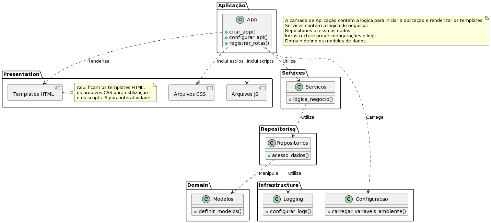
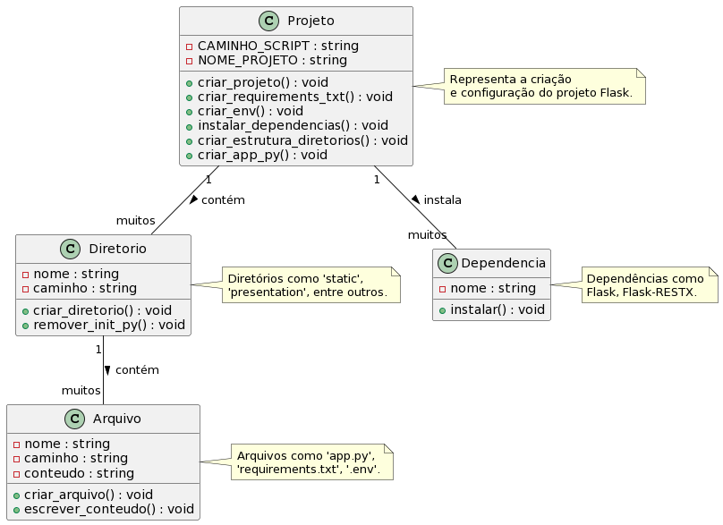

# Projeto Flask com Arquitetura Onion

## Introdução

Este projeto apresenta um script Bash projetado para automatizar a configuração inicial de projetos Flask, seguindo a arquitetura Onion. Este script incorpora boas práticas de engenharia de software e padrões de design para criar um ambiente de desenvolvimento robusto, organizado e pronto para escalar.

## Instalação

Para usar o script, clone o repositório Git e dê permissão de execução ao arquivo:

```bash
chmod +x nome_do_script.sh
```

Execute o script com o nome do projeto como argumento:

```bash
./python_flask.sh nome_do_projeto
```

## Características

- **Automação de Configuração**: Automatiza a criação do ambiente de desenvolvimento.
- **Verificação de Argumentos**: Checa se o nome do projeto foi fornecido.
- **Uso de Variáveis**: Torna o script flexível e fácil de adaptar.
- **Organização do Código**: Segue a arquitetura Onion para separação de responsabilidades.
- **Arquivos de Configuração**: Gera `.env` e `requirements.txt` automaticamente.
- **Logging**: Implementa logging com `RotatingFileHandler`.

## Dependências

Necessita de Bash, Git, e Python com Pip. Certifique-se de que estão instalados e atualizados.

## Configuração

O script configura automaticamente arquivos `.env` e `requirements.txt`. Edite conforme necessário.

## Documentação

### Arquitetura do Projeto Python



### Arquitetura do Script



## Contribuidores

Contribuições são bem-vindas seguindo as práticas de fork e pull request no GitHub.
